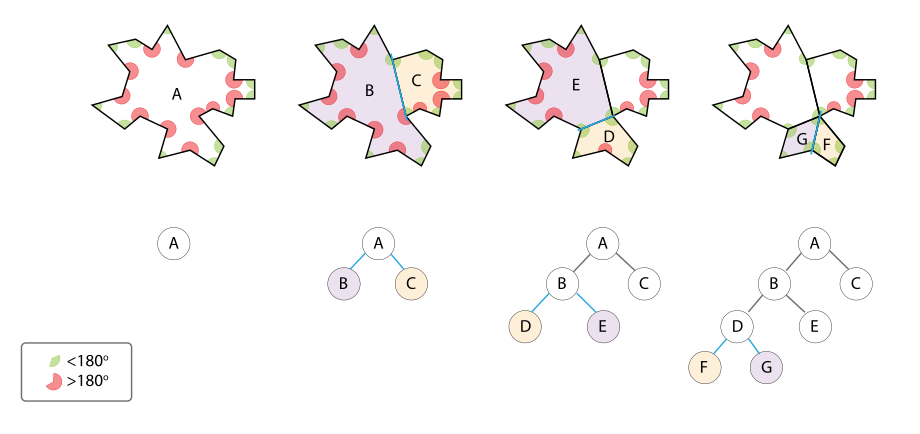

[CPP02](#cpp02)   
- [EX03](#ex03)   
  - [Description](#description)   
  - [BSP](#bsp)  
  - [Implement](#implement)   
[참고 자료](#참고-자료)   

# CPP02 

## EX03

### Description

이 과제는 한 점을뜻하는 Point 클래스를 구현하고 특정 Point가 삼각형안에 존재하는지를 찾는 BSP함수를 구현하는 것이다   

### BSP

`BSP stands for Binary space partitioning. You are welcome. :)`

BSP란 유클리드 공간을 초평면 상의 블록 집합으로 분할하는 기법이다   
분할하는 과정에서 BSP 트리구조가 생성된다    

이 기법은 DOOM이라는 게임에서 최초로 도입하게 되어 3D공간의 맵을 효율적으로 구성하였다    
이를 통해 게임의 폴리곤 중복을 줄이고 렌더링 성능을 극대화 하여 게임의 최적화에 큰 기여를 하였다    

지금날에는 ray tracing이나 Collision detection에 많이 사용한다   




위 그림은 폴리곤을 나누는 최소 단위로 `볼록한 다각형`으로 분할하는 과정을 묘사한 것이다   

BSP 트리 구축의 과정은 다음과 같다   

1. 기준 폴리곤(루트 노드)을 선택한다 (여기서 잘 선택해야 효율적인 트리를 구축할 수 있다)   
2. 선택한 폴리곤의 평면 방정식에 따라 나머지 폴리곤들을 앞, 뒤를 기준으로 리스트를 생성한다         
3. 앞 리스트와 뒤 리스트 각각에서 새로운 기준 폴리곤을 선택하여 앞, 뒤로 분할하여 자식노드를 생성한다   
4. 이 과정을 재귀적으로 반복하여 원하는 기준의 리프노드(폴리곤 형태)를 전부 생성한다   

[이곳](https://en.wikipedia.org/wiki/Binary_space_partitioning)에서 그 과정이 잘 표현되어 있다   

여기서 의문이 생기는 과정이 2가지가 존재한다   

- 앞 리스트와 뒤 리스트에서의 폴리곤을 선택하는 기준이 무엇인가?   
- 폴리곤을 나누면서 나아가는 과정에서 중복되는 서브 트리가 생성되지 않는가?   

이 둘의 답변은 다음과 같다

폴리곤을 선택하는 기준은 상황에 따라 다르지만, 일반적으로 트리의 좌우가 크게 변하지 않는 것을 선택한다고한다   

서브트리는 폴리곤이 겹치는 과정에서 나누면서 중복되는 서브트리가 생기는 경우가 많은데 이는 hash map같은 자료구조를 이용하여 중복을 방지한다고 한다   
	
### Implement

주어지는 정보는 삼각형의 세 점 **a,b,c**와 한 점 **point**가 주어진다   
여기서 **point**가 삼각형 abc내부에 존재하는지를 찾는 알고리즘을 구현하는 것이다   
BSP 트리는 3차원 공간을 트리구조로 변환, 분할하여 렌더링 속도를 최적화하거나 충돌감지에 사용한다   
폴리곤은 일반적으로 도형의 최소단위인 삼각형으로 이루어져 있고 이러한 삼각형들이 모여 폴리곤 덩어리가 된다       
ray를 발사하여 특정 폴리곤에 닿은 **point**를 찾고, BSP 트리를 탐색하며 **a,b,c**로 정의된 폴리곤(삼각형)에 **point**가 속해있는지를 찾는 문제로 이해했다    

그렇기에 아주 단순한 알고리즘인 [Point-in-Triangle Test 알고리즘](https://blackpawn.com/texts/pointinpoly/)을 사용하였다   

```c++
#include "Point.hpp"
#include "Fixed.hpp"

bool bsp( Point const a, Point const b, Point const c, Point const point) {
	Fixed d1(sign(point, a, b));
	Fixed d2(sign(point, b, c));
	Fixed d3(sign(point, c, a));

	// 오로지 점이 선분의 시계, 반시계에 존재하는지를 확인하기 때문에
	// 삼각형이 뒤집히면 그 기준도 달라지기에 삼각형, 뒤집힌 삼각형의 두가지 경우를 고려해야 한다
	bool has_neg = (d1 < 0) || (d2 < 0) || (d3 < 0);
	bool has_pos = (d1 > 0) || (d2 > 0) || (d3 > 0);

    return !(has_neg && has_pos); 
}

// p3->p1 벡터와 p3->p2 벡터의 외적을 계산하여    
// z축이 음수, 양수인지에 따라 점 p1이 p3->p2 벡터의 시계방향에 있는지, 반시계 방향에 있는지를 판별하기 위한 공식   
Fixed sign( const Point& p1, const Point& p2, const Point& p3 ) {
	return ((p1.getX() - p3.getX()) * (p2.getY() - p3.getY()) - 
			(p2.getX() - p3.getX()) * (p1.getY() - p3.getY()));
}
```

# 참고 자료

[위키피디아](https://en.wikipedia.org/wiki/Binary_space_partitioning;)
