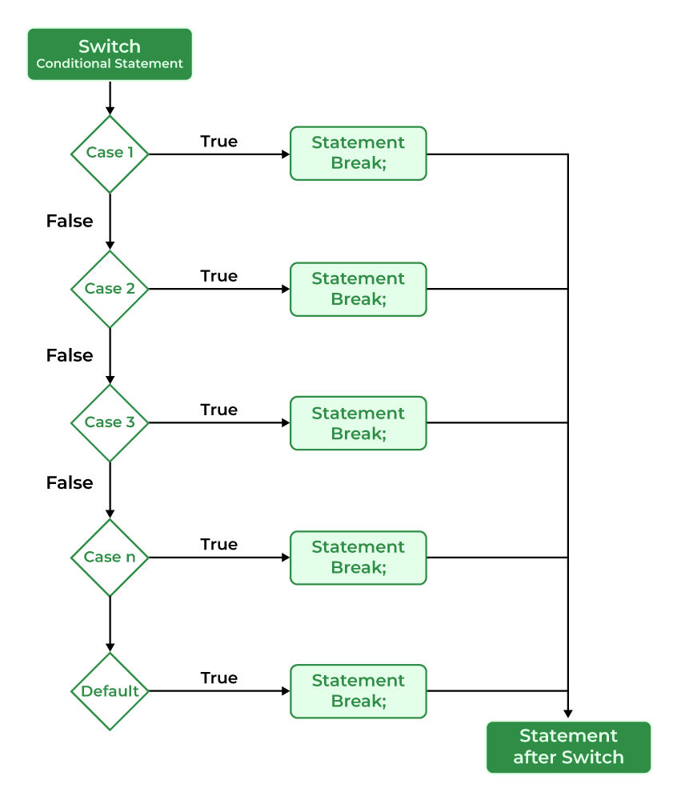

## INDEX

- [CPP\_01: EX\_04](#cpp_01-ex_04)
	- [Description](#description)
	- [Implement](#implement)
	- [Concepts](#concepts)
		- [switch statement](#switch-statement)

---
# CPP_01: EX_04

## Description

[이전 과제](../ex05/)에서 단계별 선택을 switch case문으로 구현하라

## Implement

```c++
void Harl::complain( std::string level ) {
	pointer_to_function funcs[LEVEL_NUM] = { &Harl::debug, &Harl::info, &Harl::warning, &Harl::error };

	int i = levelToInt( level );
	if (i < LEVEL_NUM) {
		(this->*(funcs[i]))();
	} else {
		std::cout << "Invalid level" << std::endl;
	}
}
```

에서

```c++
int Harl::levelToInt( std::string level ) {
	const std::string levels[LEVEL_NUM] = { "DEBUG", "INFO", "WARNING", "ERROR" };
	
	int i = 0;
	while (i < LEVEL_NUM) {
		if (level == levels[i])
			break;
		++i;
	}
	return (i);
}

void Harl::complain( std::string level ) {
	int i = levelToInt( level );
	switch (i) {
		default:
			std::cout << "[ Probably complaining about insignificant problems ]" << std::endl;
			break;
		case 0:
			this->debug();
			__attribute__((fallthrough));
		case 1:
			this->info();
			__attribute__((fallthrough));
		case 2:
			this->warning();
			__attribute__((fallthrough));
		case 3:
			this->error();
			break;
	}
}
```

으로 구현하였다   

여기에서 **__attribute__((fallthrough));** 에 대해 부연설명을 하자면 일반적으로 case문에 **break;**를 넣지 않으면 그 다음 케이스로 넘어가게 된다 하지만 이를 컴파일러는 위험하다고 판단하여 에러를 내뱉는데 이를 막고자 컴파일러에게 fall-through를 의도하여 사용했다는 것을 알려주는 것이다   

C++17 부터 [[fallthrough]]라는 형식으로 바뀌었다   


## Concepts

### switch statement

**Syntax**   
`attr(optional) switch ( init-statement(optional) condition ) statement`

`attr`	-	(since C++11) 아무 속성값 숫자     
`init-statement`	-	(since C++17) 다음중 하나:   
명령문 표현식 (nullptr일 수 있음)   
간단한 선언, 일반적으로 초기화가 있는 변수의 선언이지만, 여러 변수나 구조화된 바인딩을 선언할 수도 있다
별칭 선언일 수도 있음 (since C++23)   
어떤 초기화 문이라도 반드시 세미콜론으로 끝나야 한다는점에 유의해야한다   
이는 비공식적으로는 세미콜론으로 끝나는 표현식이나 선언으로 자주 설명되는 이유이다   

`condition`	-	조건   
`statement`	-	명령문

switch 문의 조건에는 상수값을 가져야한다

```c++
// 상수 표현식 허용 
switch(1+2+23) 
switch(1*2+3%4) 

// 변수 표현식 허용 
// 고정된 값이 할당된 경우 
switch(a*b+c*d) 
switch(a+b+c)
```

**Label**   

`attr(optional) case constant-expression:`   
`attr(optional) default:`   

`attr`	-	(since C++11) 아무 속성값 숫자   
`constant_expression`	-	int or char type
`default`	-	해당 키워드는 일치하는 케이스 값이 없을 때 실행되는 기본 케이스를 정의하는데 사용된다 이는 선택사항이다    

case값에는 중복된 값이 허용되지 않으며 모든 case값은 고유해야 한다   
또한 C++에서는 한 스위치를 다른 스위치 문 안에 중첩할 수 있지만 이는 가독성과 프로그램의 복잡성을 높이기에 피하는 것이 좋다   

*switch 문의 흐름도*



[*switch 문 예제*](./test/SwitchStatement.cpp)


