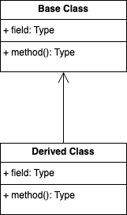
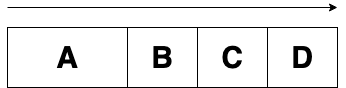

## INDEX

- [CPP 03](#cpp-03)
	- [Description](#description)
	- [Concepts](#concepts)
	- [Implement](#implement)
		- [Inheritance](#inheritance)
			- [선언 및 사용법](#선언-및-사용법)
				- [protected](#protected)
			- [상속을 왜 사용할까?](#상속을-왜-사용할까)
			- [ia a, has a](#ia-a-has-a)
			- [상속의 생성자, 소멸자 호출 순서](#상속의-생성자-소멸자-호출-순서)
				- [상속의 초기화](#상속의-초기화)
		- [Name hiding](#name-hiding)
			- [derived 클래스에서의 overload](#derived-클래스에서의-overload)
		- [Multiple inheritance](#multiple-inheritance)
			- [다이아몬드 상속](#다이아몬드-상속)
			- [bridge pattern](#bridge-pattern)
			- [nested generalization](#nested-generalization)
- [참고자료](#참고자료)

---
# CPP 03

## Description

Inheritance, 상속을 다루어 보자

## Concepts

## Implement

상속에서 파생 클래스의 생성자가 먼저 호출되나 파생 클래스가 기반 클래스의  생성자를  호출하게되어 기반 클래스의 생성자가 먼저 동작하고 그 이후에 파생 클래스의 생성자가 동작한다        

생성자의 호출순서와 실행순서는 일치하지 않는다   

생성자는 객체 자신만을 초기화 해야 한다!   

상속시 파생형식 생성자에서 부모 멤버를 초기화 하는 것은 잘못된것    
(만일 파생형식 클래스가 초기화를 할때에는 이미 부모가 초기화가 이루어지고 난 이후이다 그렇기에 값이 변경이되나 이는 큰 실수를 초래할 수 있게 된다   
만일 private 멤버 변수라면 바꾸지 못하기도 하다)   

메소드가 일반형식이면 접근형식을 따르고 virtual이면 실형식을 따른다      
(A* pData = new B; 라고 했을때, 특정함수가 파생클래스에서 재정의 되었다고 가정해보자   
이 때, 해당 기반클래스의 함수가 일반형식이면 A형식을 따르고 virtual이면 B형식을 따른다)

    

     

   

가상함수 - 기반 클래스에서 확장 클래스를 호출하는 방식, 미래를 호출한다!   


   
레거시 코드와 현재 코드의 순서를 잘 맞춰야함   
두개의 코드가 공존하게 된다   
혹은 overwrite할 수 있다   
이는 모두 확장을 하는것이다   
재정의는 곧 확장이다 하지만 늘어나기만하고 줄어들지는 않는다   

[다시볼 필요가있음](https://www.youtube.com/watch?v=1W4CkEMajQs&list=PLXvgR_grOs1DFOWF65X0Zqnd_264x41u-&index=22)   

A* pData = new B;  여기서 소멸자 호출하면 릭이 남 왜냐하면 A소멸자는 호출되는데 B 소멸자는 호출이 안되어서   
그래서 virtual키워드를 넣어줘야 함   

### Inheritance

**상속, 相續**
*뒤를 잇는 일.*

CPP에서의 정의는 다른 객체를 결합하고 연결하여 새 객체를 만드는 것과는 달리 상속은 다른 객체의 속성과 동작을 그대로 이어받은 다음 이를 확장하거나 특수화하여 새로운 객체를 만드는것을 의미한다   

이러한 상속은 컴퓨터를 생각해보면된다   
처음 폰 노이만이 설계한 컴퓨터를 기반(Base)으로부터 확장하고 특수화 하여 여러 종류의 컴퓨터들이 파생(Derived)되어 나오게 된 것을 생각을 하면 잘 이해가 갈 것이다   

당장의 CPP도 C로부터 대부분의 기능을 물려받은 것을 보면 이는 상속받았다고 볼 수 있다   

상속을 통한 관계를 다이어그램으로 표현하면 다음과 같다   



여기서 ClapTrap 클래스를 Parent, Base, Super 클래스라고 하며 ScavTrap 클래스를 Child, Derived, Sub 클래스라고 한다   

#### 선언 및 사용법

초기화 리스트를 사용하듯 클래스 선언부에 `:` 뒤에 접근 제어자와 상속될 Base 클래스의 이름을 적어준다   
클래스 처럼 접근제어자를 명시하지 않으면 private으로 설정된다   

**E.G.**   
```c++
class Pub: public Base {

};

class Pro: protected Base {

};

class Pri: private Base {

};

// defaults to private inheritance
class Pub: public Base {

};
```

여기서 우리는 접근제어자 3개를 이용해 상속을 하는데 기반 클래스의 멤버가 어떠한 접근제어자로 선언되어있는지에 따라 동작이 달라지게 되어 총 9가지 조합의 동작으로 나뉘게 된다    

|Access specifier in base class| base class	Access specifier when inherited publicly| inherited publicly	Access specifier when inherited privately|Access specifier when inherited protectedly|
|-|-|-|-|
|Public|Public|Private|Protected|
|Protected|Protected|Private|Protected|
|Private|Inaccessible|Inaccessible|Inaccessible|

**E.G.**   
```c++
#include <iostream>

class Base {
public:
	int b_pub = 0;

	void printMember() {
		std::cout << b_pub << std::endl;
		std::cout << b_pro << std::endl;
		std::cout << b_pri << std::endl;
	};
protected:
	int b_pro = 1;
private:
	int b_pri = 2;
};


// public inheritance
class Pub : public Base { 
public: 
	void printBase() {
		std::cout << b_pub << std::endl;
		std::cout << b_pro << std::endl;
		// std::cout << b_pri << std::endl; // inaccessible
	};
};

// protected inheritance
class Pro : protected Base { 
public: 
	void printBase() {
		std::cout << b_pub << std::endl;
		std::cout << b_pro << std::endl;
		// std::cout << b_pri << std::endl; // inaccessible
	};
};

// private inheritance
class Pri : private Base { 
public: 
	void printBase() {
		std::cout << b_pub << std::endl;
		std::cout << b_pro << std::endl;
		// std::cout << b_pri << std::endl; // inaccessible
	};
};


int main() {
	std::cout << "===== print base =====" << std::endl;
	Base base;
	base.printMember();

	std::cout << "===== print pub =====" << std::endl;
	Pub pub;
	pub.printBase();
	pub.b_pub = -1;
	// pub.b_pro = -1; // inaccessible
	// pub.b_pri = -1; // inaccessible

	std::cout << "===== print pro =====" << std::endl;
	Pro pro;
	pro.printBase();
	// pro.b_pub = -1; // inaccessible
	// pro.b_pro = -1; // inaccessible
	// pro.b_pri = -1; // inaccessible

	std::cout << "===== print pri =====" << std::endl;
	Pri pri;
	pri.printBase();
	// pro.b_pub = -1; // inaccessible
	// pro.b_pro = -1; // inaccessible
	// pro.b_pri = -1; // inaccessible

}
``` 

##### protected

public, private 과 같은 접근지정자중 하나   

상속에서만 사용하는 키워드로 외부 접근에는 private으로 Derived 클래스에는 public 으로 동작한다   

하지만, 일반적으로 private 멤버를 사용하는 것이 좋다    
이는 코드의 불변성과 캡슐화를 지켜주고 protected의 기능을 인터페이스로 제공함으로써 Derived 클래스가 사용할 수 있도록 하는것이 좋다   
다만, 상속관계가 간단하고, private 멤버에 대한 별도의 인터페이스를 만드는 것이 부담이 되는 경우, protected를 사용하는 편이 좋다   


#### 상속을 왜 사용할까?

Derived 클래스에서 기반 클래스의 정보를 다시 정의할 필요가 없게되며 이는 곧 코드의 재사용을 쉽게 만들어주는 것이다   

#### ia a, has a

객체간의 관계를 표현하는데에 있어 두가지로 나뉜다   
특정 객체의 일부로 객체가 구현되는 `has-a`, 상속을 통한 `is-a` 관계가 있다   

ScavTrap은 ClapTrap이다   
여우는 동물이다   

이는 모두 `is-a` 관계라고 볼 수 있다   

#### 상속의 생성자, 소멸자 호출 순서

Derived 클래스를 인스턴스화 하면서 일반적인 다른 클래스와는 내부적으로 다르게 구현이 이루어진다   

Base -> Derived 의 순서로 Base 생성자를 사용하여 생성이 이루어진다   

chain 상속이 이루어져 있는 경우에는 항상 가장 Base 클래스를 먼저 생성하게 된다   

**E.G.**   
```c++
CPP
#include <iostream>

class A {
public:
    A() {
        std::cout << "A\n";
    }
};

class B: public A {
public:
    B() {
        std::cout << "B\n";
    }
};

class C: public B {
public:
    C() {
        std::cout << "C\n";
    }
};

class D: public C {
public:
    D() {
        std::cout << "D\n";
    }
};

int main(void) {
	D derived;
}
```

출력

```bash
A
B
C
D
```

상속이 이루어지면서 메모리에 적재되는 순서를 보면 이해가 쉬울 것이다   



일반클래스가 인스턴스화될 때의 순서     
1. 메모리 할당     
2. 객체의 생성자 호출 및 멤버 초기화     
3. 생성자 본문 실행

Derived 클래스가 인스턴스화될 때의 순서     
1. Base + Derived 메모리 할당     
2. Derived 생성자 호출    
3. Base 생성자 호출 및 Base 클래스 초기화     
4. Derived 클래스 초기화     
5. Derived 클래스 생성자 본문 실행     

적절한 메모리를 할당해주고 생성자는 Derived 클래스가 먼저 호출이 되나 초기화나 실행은 Base 클래스가 먼저 동작을하여 순서대로 클래스들을 할당된 메모리에 적재를 해주는 것이다    

소멸자는 생성자 역순으로 호출된다   

##### 상속의 초기화

CPP에서 상속된 멤버 변수는 동일한 클래스에 속해있는 생성자로만 초기화가 가능하다   

**E.G.**   
```c++
class Base {
	int a_;

	Base() : a_(10) {}
};

class Derived {
	double b_;

	// 불가능하다
	// Derived() : a_(10), b_(10.0) {}

	// 이는 가능하나 a_가 const or reference라면 동작하지 않는다   
	// Derived() : b_(10.0) { a = 10; }

	// 기반클래스 생성자를 호출하여 먼저 초기화 한다 
	// 생성자를 선언하지 않아도 base의 기본 생성자가 호출된다  
	Derived() : Base(), b_(10.0) {}
};
```

이는 const 키워드와 reference 타입의 경우에는 생성과 동시에 초기화가 이루어져야 하므로 해당 변수와 동일한 클래스 내에 있는 초기화 목록을 사용하는 생성자만 사용이 가능하기 때문이다    

### Name hiding

Derived 클래스 객체가 멤버 함수를 호출하게되면 컴파일러는 객체의 런타임 타입에 따라 Derived 클래스 내부에서 먼저 일치하는 함수를 찾고 일치하는 함수가 없다면 상속 체인을 타고 올라가면서 Base 클래스로부터 일치하는 함수를 찾는다   

이러한 특성을 통해 Base 클래스에 있는 함수가 어떠한 접근 제어자로 선언이 되어 있든 Derived 클래스에서 public redefine 할 수 있다 (public 외에도 다른 접근 제어자로 선언할 수 있으며 그 반대로도 가능하다)   

**E.G.**
```c++
#include <iostream>

class Base {
public:
    Base() {};

    void identify() const { std::cout << "Base::identify()" << std::endl; }
};

class Derived: public Base {
public:
    Derived() {};

    void identify() const { std::cout << "Derived::identify()" << std::endl; }
};

int main()
{
    Base base;
    base.identify(); // "Base::identify()"

    Derived derived;
    derived.identify(); // "Derived::identify()"
}
```

이는 다른말로 `Derived::identify()` 가 `Base::identify()` 를 숨겼다(hiding)! 라고 한다   

만약 Base의 `identify()`를 derived에서 호출하고 싶다면 `Base::identify();` 를 derived 내부에서 Base의 `identify()`를 호출할 수 있다

**E.G.**
```c++
class Derived: public Base {
public:
    Derived() {};

    void identify() const { 
		Base::identify(); // "Base::identify()"
		std::cout << "Derived::identify()" << std::endl; 
	}
};
```

Base의 friend 함수의 경우에는 실제로 Base 클래스의 일부가 아니기 때문에 `::` 범위 지정 연산자를 사용하는 것이 불가능 하다   
이는 `static_cast`를 통해 쉽게 해결이 가능하다   

**E.G.**
```c++
class Derived: public Base {
public:
    Derived() {};

    void identify() const { 
		static_cast<Base const&>(*this).identify();
		std::cout << "Derived::identify()" << std::endl; 
	}
};
```

#### derived 클래스에서의 overload


### Multiple inheritance

#### 다이아몬드 상속

#### bridge pattern

#### nested generalization

# 참고자료

[다중상속의 사용](https://isocpp.org/wiki/faq/ multiple-inheritance#virtual-inheritance-where)   

[모두의 코드](https://modoocode.com/category/C++
CPP)   


