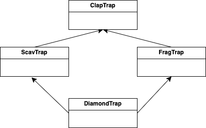
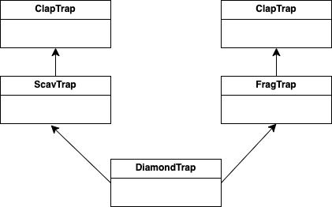

## INDEX

- [CPP 03: EX\_03](#cpp-03-ex_03)
	- [Description](#description)
	- [Implement](#implement)
	- [Concepts](#concepts)
		- [Multiple inheritance](#multiple-inheritance)
			- [다중 상속시 컴파일러 탐색 순서](#다중-상속시-컴파일러-탐색-순서)
			- [Mixin](#mixin)
			- [다이아몬드 상속](#다이아몬드-상속)
		- [virtual](#virtual)
			- [소멸자 가상화](#소멸자-가상화)

---
# CPP 03: EX_03

## Description

다중 상속   

그중 다이아몬드 상속을 구현하라 허나, 상속 받는 주체는 한번만 생성 되어야 한다   

## Implement

다이아몬드 상속은 좋지않은 결과를 초래한다    
허나 이를 해결할 수 있는 방식은 몇가지가 있지만 그중 가상 상속을 통해 해결하였다     

각 ScavTrap, FragTrap에서 ClapTrap을 상속할때 virtual로 상속을 하였고 이로 인해 ClapTrap은 한번만 생성이 된다   

ClapTrap 생성시 최종 Derived에서 생성자를 호출하여 한번에 초기화를 하도록 하였다   
그리고 각 Trap별로 기본 멤버변수 값을 `static const`로 protected에 선언함으로서 상속하는 DiamondTrap에서 해당 값을 가져다 초기화에 쓸수 있도록 하였다   

```c++
static const unsigned int default_hit_points_ = 100;
static const unsigned int default_energy_points_ = 100;
static const unsigned int default_attack_damage_ = 30;
```   

ScavTrap의 attack()함수를 그대로 가져와 쓰도록 하라는 요구사항이 있어서 ScavTrap을 먼저 상속받도록 해서 ScavTrap::attack()이 먼저 실행되도록 하는것도 있지만 가독성을 우선시하여 DiamondTrap에서 redefine하여 ScavTrap::attack()을 호출하도록 하였다   

## Concepts

### Multiple inheritance

다중 상속   

다중 상속은 말그대로 상속을 한번에 여러개 받는 것이다   

#### 다중 상속시 컴파일러 탐색 순서

```c++
class ScavTrap : virtual public ClapTrap  { ... };
class FragTrap : virtual public ClapTrap  { ... };

class DiamondTrap : public ScavTrap, public FragTrap { ... };
```

상속을 이런식으로 받을 경우에는 컴파일러의 탐색 순서는 다음과 같다   

DiamondTrap -> ScavTrap -> FragTrap -> ClapTrap   

하지만 여기서 ScavTrap과 FragTrap에서 동일한 이름의 함수가 발견되면 모호성이 생기게 되므로 Diamond에서 함수 override를 해주거나 원하는 attack() 함수를 호출하도록 선택하면 된다   

#### Mixin

다른 클래스의 Base가 되지 않으면서 다른 클래스에서 사용할 수 있는 메서드를 포함하는 클래스   
원하는 기능만들 Derived에 보내 `is - a` 관계를 아주 약하게 구성하는 것이다   

이러한 방식은 주로 Templete과 함께 사용되는데 대표적인 예로 [`CRTP`](https://en.cppreference.com/w/cpp/language/crtp)가 있다   

예제는 간단하게 [learncpp](https://www.learncpp.com/cpp-tutorial/multiple-inheritance/)에서 가져왔다   

**E.G.**
```c++
// h/t to reader Waldo for this example
#include <string>

struct Point2D
{
	int x{};
	int y{};
};

class Box // mixin Box class
{
public:
	void setTopLeft(Point2D point) { m_topLeft = point; }
	void setBottomRight(Point2D point) { m_bottomRight = point; }
private:
	Point2D m_topLeft{};
	Point2D m_bottomRight{};
};

class Label // mixin Label class
{
public:
	void setText(const std::string_view str) { m_text = str; }
	void setFontSize(int fontSize) { m_fontSize = fontSize; }
private:
	std::string m_text{};
	int m_fontSize{};
};

class Tooltip // mixin Tooltip class
{
public:
	void setText(const std::string_view str) { m_text = str; }
private:
	std::string m_text{};
};

class Button : public Box, public Label, public Tooltip {}; // Button using three mixins

int main()
{
	Button button{};
	button.Box::setTopLeft({ 1, 1 });
	button.Box::setBottomRight({ 10, 10 });
	button.Label::setText("Submit");
	button.Label::setFontSize(6);
	button.Tooltip::setText("Submit the form to the server");
}
```

#### 다이아몬드 상속



상속관계가 다이아몬드처럼 구조를 이루고 있다고 하여 붙여진 이름   

다이아몬드 상속에는 문제가 많다   

구조로는 동일한 ClapTrap을 상속받고 있는것 처럼 보이지만 실제로는 2개의 ClapTrap을 상속받아 사용하고 있으며 이는 메모리 낭비이며 어떠한 ClapTrap 멤버에 접근해야하는지에 대한 모호성 문제가 발생하게 된다   



즉 `ClapTrap::name_` 과 같은 멤버 변수들이 2개씩 생기게 되는것이다   
모호성을 해결하여 컴파일러가 알았다 하여도 사람인 사용자는 높은 코드의 복잡성과 낮은 가독성 때문에 알기 힘들 것이다   

이러한 다이아몬드 상속은 피하는 것이 좋다   
그중 virtual 키워드를 사용한 가상 상속으로 공통된 Base 클래스의 인스턴스를 하나만 생성하여 해결하는 방법이 있다   

### virtual

Base 클래스에서 Derived 클래스가 함수를 재정의(override)할 수 있도록 사용하는 키워드로 다형성을 구현하는데 사용된다   

일반적으로 Base 클래스의 함수 앞에 붙으며 해당 가상 함수가 호출될 때 가상 함수는 런타임에 가상함수 테이블(VTable)에서 호출할 함수를 결정한다   
그렇기에 Derived에 Base에 있는 가상함수를 재정의했다면 어느걸 호출해도 Derived의 override된 함수가 호출된다   

#### 소멸자 가상화

이러한 특성은 소멸자에도 적용이 된다   

예시를 한번 보자   

**E.G.**
```c++
#include "iostream"

class Base 
{
public:
	Base() { std::cout << "Base::Base()" << std::endl; }
	~Base() { std::cout << "Base::~Base()" << std::endl; }
};

class Derived : public Base
{
public:
	Derived() { std::cout << "Derived::Derived()" << std::endl; }
	~Derived() { std::cout << "Derived::~Derived()" << std::endl; }
};

int main(void)
{
	Base* base = new Derived;
	delete base;
}
```

**output**
```bash
Base::Base()
Derived::Derived()
Base::~Base()
```

소멸자 호출시 Base의 범위에 있는 소멸자만 호출되는 것을 볼 수 있다   
하지만 애초에 생성될때 Derived로 생성이 되었기에 뒤에 남아있는 Derived의 메모리 영역은 홀로 남게 되며 이는 메모리 누수로 이어지게 된다   

    

`Base::~Base()`   

   

해결방법으로 Base의 소멸자에 virtual 키워드를 줌으로서 Derived 클래스의 소멸자가 먼저 호출되도록 한다   

```c++
#include "iostream"

class Base 
{
public:
	Base() { std::cout << "Base::Base()" << std::endl; }
	virtual ~Base() { std::cout << "Base::~Base()" << std::endl; }
};

class Derived : public Base
{
public:
	Derived() { std::cout << "Derived::Derived()" << std::endl; }
	~Derived() { std::cout << "Derived::~Derived()" << std::endl; }
};

int main(void)
{
	Base* base = new Derived;
	delete base;
}
```

**output**
```bash
Base::Base()
Derived::Derived()
Derived::~Derived()
Base::~Base()
```
