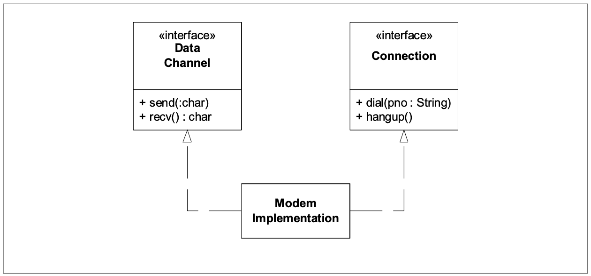

# Single Responsibility (SRP)

## Description

**THERE SHOULD NEVER BE MORE THAN ONE REASON FOR A CLASS TO CHANGE.**

클래스를 바꾸는데에 둘 이상의 이유가 있어서는 안된다   
이는 다른 말로는, 모든 클래스는 오직 하나의 책임(responsibility)을 가져야 한다는 것이다   

## Class diragram


## Responsibility(책임) 란?

SRP에서 정의한 Responsibility(책임)는 `변경의 이유` 이다   
만약 어떤 클래스에 대해 변경할 이유가 여러가지 떠오른다면, 그 클래스는 여러 책임을 가지고 있는 것이다   
그렇다고 해당 클래스가 여러 책임을 가지고 있는 것을 쉽게 알 수 있는 것은 아니다   
우리는 종종 책임을 하나의 그룹으로 생각하는데 익숙해져 있는데 이는 아래의 예시로 설명할 수 있다
```java
interface Modem
{
public void dial(String pno);
public void hangup();
public void send(char c);
public char recv();
}
```
Modem 인터페이스는 합리적으로 보이며 4개의 함수들은 확실히 Modem에 속해있는 함수들로 보인다   
하지만 이는 2가지 책임으로 분리할 수 있는데   
1. 연결   
2. data 통신   
   
으로 `dial`과 `hangup`함수는 Modem의 연결을 관리하고, `send`와 `recv`함수는 data 통신을 관리하는 것을 볼 수 있다  

이 둘을 꼭 분리해야 할까...?   
단도직입적으로 말하자면 반드시 분리해야한다, 이 두 함수 집합은 공통점이 거의 없을 뿐더러 분명히 서로 다른 이유로 변경이 이루어질 것이다   
또한, 이 함수들은 애플리케이션의 완전히 다른 부분에서 호출될 것이며 그 다른 부분마저도 서로 다른 이유로 변경될 것이기 때문이다   



여기서 주목해야 할 점은 두 가지 책임을 다시 하나의 `ModemImplementation` 클래스에 결합했다는 것이다   
이는 바람직하지는 않지만.. 필요할 수 있다   
하드웨어나 운영체제의 세부사항과 관련된 이유로, 우리가 결합하고 싶지 않은 것들을 결합해야하는 경우가 종종 있으며, 이는 인터페이스를 분리함으로써, 애플리케이션의 나머지 부분에서는 개념적인 분리를 유지할 수 있다   

`ModemImplementation`를 임시방편이나 문제점으로 볼 수는 있다   
하지만 모슨 의존성이 이 클래스에서 벗어나는 방향으로 흐르고 있다는 것을 주목하라   
이 클래스에 의존할 필요는 없다   
main 함수 외에는 이 클래스가 존재한다는 사실을 알 필요가 없으며 이에 따라 그 문제점이 애플리케이션의 다른부분에 영향을 미쳐 오염시키지 않도록 하기 위해서 울타리 뒤에 숨겼다   

결론적으로 단일 책임 원칙(SRP)는 가장 단순한 원칙 중 하나이나, 제대로 지키기 어렵다   
책임을 결합하는 것은 우리에게 있어 자연스러운 행동이며 이러한 책임들을 찾아내고 서로 분리하는 것이 소프트웨어 설계의 핵심이다   

사실, 우리가 앞으로 논의할 다른 원칙들도 결국 어떻게든 이 문제로 다시 돌아올 것이다   
 

[출처](https://web.archive.org/web/20150202200348/http://www.objectmentor.com/resources/articles/srp.pdf)
