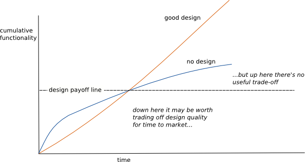

우리가 처음 Application을 만들때에는 마치 하나의 아름다운 꽃처럼 완벽했다   

하지만 시간에 지남에 따라 앱을 바꾸면서 무언가를 추가함에 따라 더이상 앱은 아름답지 못하고 의존성(dependency)이 추가되면 추가될수록 의존성이 우리의 목을 죄어오게 된다   

   
[출처](https://www.sandordargo.com/blog/2018/03/06/design-stamina-hipothesis)   

위의 그래프를 보면 설계를 제대로 했을때에 안했을때보다 어느 순간 더 좋아지는 순간이 온다는것을 볼 수 있다   

## SOLID

- Single responsibility
- Open/Closed
- Listkov substitution
- Interface segregation
- Dependency inversion

의 약어이다     

이 디자인들은 각자 설명하는 바가 달라보이지만 사실 이들은 모두 의존성에 관하여 이야기하고 있다   

이 의존성을 최소화하여 앱 내부의 동작하는 단위와 공간을 최소화하여 교체나 추가하는데에 있어 자유롭게하기 위함이다   

찬장에 그릇들이 아무렇게 들어가 있어 어지럽게 되어 있다고 해보자    

   

여기서 우리는 그릇을 하나 바꾸거나 추가하고 싶을때, 큰 어려움을 가지게된다    
이 그릇들은 의존성이다   
하나를 빼었을때 다른 그릇들이 어떻게될지 무슨일이 일어날지 모두가 안다    

---

### 영상 정리

[youtube](https://www.youtube.com/watch?v=v-2yFMzxqwU)   

- 우리가 코드를 테스트할때, 그 테스트에 어려움이 있다면 코드가 잘못 짜여져 있을 확률이 높다   
	정확히 말하자면 우리의 설계가 잘못되었을 확률이 높다는 것이다   

	TDD는 우리가 코드의 설계를 모르거나 잘못하였을경우 벌을 줄 것이다   

- 모든곳에 Mocking을 할 수 있도록하는것은 코드를 취약(fragile)하게 만드는 것이다    
	영상에서는 테스트하는 코드가 실행내내 변하지 않을 정적 데이터를 위한 컨테이너를 가져올 뿐이므로 Mocking을 할 이유가 전혀 없다고한다   

- 우리가 작성하는 코드가 어느 방향으로 갈지 추측하지마라 그저 그 순간에 가장 간단하게 작성하라   

- 일단 코드를 쓰고 규칙에 따라 리팩토링을 하라   
	누구나 모든것을 예상하고 코드를 작성할수는 없다   
	리팩토링이 완벽하게된 코드를 보라 처음보면 너무 완벽해서 감탄을하게된다   
	하지만 이러한 코드들은 한번에 작성된것이 아니다   
	그리고 이러한 리팩토링된 코드들은 너도 작성할수 있다   

- 분리한 코드들을 변경되는 빈도에 맞게 나열을 하였을때, 종속성을 변경이 잘 되지 않는 객체를 변경이 잘 이루어지는 객체에 부여를 하는 방향으로 가야하며, 이것들을 실제로 나열했을때에 우리가 어디서 어떻게 리팩토링을 해야하는지를 알 수 있다   

